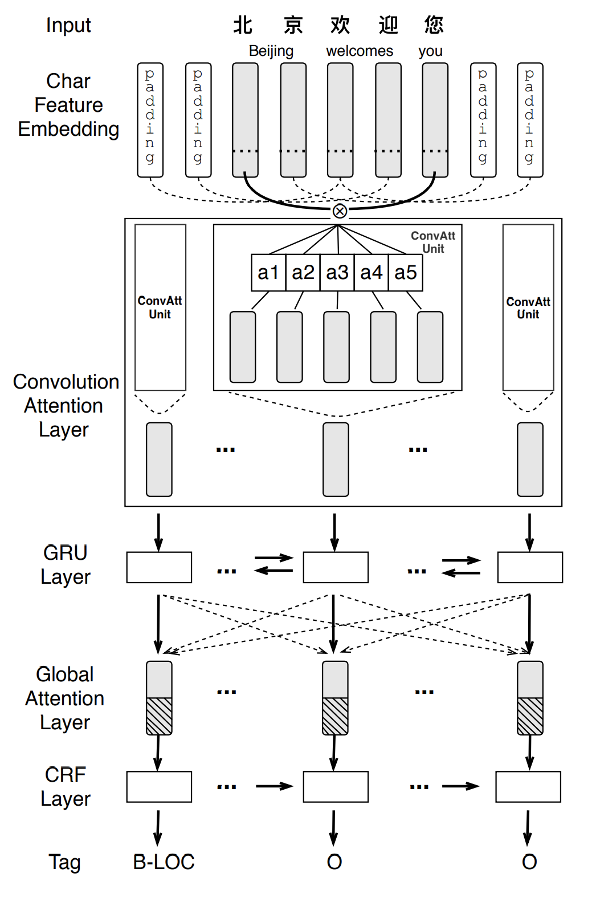

# CAN-NER: Convolutional Attention Network for Chinese Named Entity Recognition

This repository is the official implementation of [CAN-NER: Convolutional Attention Network for Chinese Named Entity Recognition](https://arxiv.org/abs/1904.02141) (NAACL2019). 

In this paper, we investigate a Convolutional Attention Network (CAN) for Chinese NER, which consists of a character-based convolutional neural network (CNN) with local-attention layer and a gated recurrent unit (GRU) with global self-attention layer to capture the information from adjacent characters and sentence contexts. CAN-NER does not depend on any external resources like lexicons and employing small-size char embeddings makes CAN-NER more practical for real systems scenarios. 




## Requirements

To install requirements:

```setup
pip install -r requirements.txt
```


## Arguments
All command arguments are list as following:

```
usage: train.py [-h] [--model_name MODEL_NAME]
                [--data_name {weibo,MSRA,onto4}]
                [--train_data_path TRAIN_DATA_PATH]
                [--test_data_path TEST_DATA_PATH]
                [--dev_data_path DEV_DATA_PATH]
                [--pretrained_embed_path PRETRAINED_EMBED_PATH]
                [--result_folder RESULT_FOLDER] [--seed SEED]
                [--batch_size BATCH_SIZE] [--epoch EPOCH] [--lr LR]
                [--dropout DROPOUT] [--hidden_dim HIDDEN_DIM]
                [--window_size WINDOW_SIZE] [--is_parallel]

CAN-NER Model

optional arguments:
  -h, --help            show this help message and exit
  --model_name MODEL_NAME
                        give the model a name.
  --data_name {weibo,MSRA,onto4}
                        name for dataset.
  --train_data_path TRAIN_DATA_PATH
                        file path for train set.
  --test_data_path TEST_DATA_PATH
                        file path for test set.
  --dev_data_path DEV_DATA_PATH
                        file path for dev set.
  --pretrained_embed_path PRETRAINED_EMBED_PATH
                        path for embedding.
  --result_folder RESULT_FOLDER
                        folder path for save models and results.
  --seed SEED           seed for everything
  --batch_size BATCH_SIZE
  --epoch EPOCH         epoch number
  --lr LR               learning rate
  --dropout DROPOUT     dropout rate
  --hidden_dim HIDDEN_DIM
                        hidden dimension
  --window_size WINDOW_SIZE
                        window size for acnn
  --is_parallel         whether to use multiple gpu
```

## Train

To train the model(s) in the paper, run this command:

```train
python train.py
--model_name <demo_model> \
--data_name MSRA \
--train_data_path <path_to_data> \
--test_data_path <path_to_data> \
--dev_data_path <path_to_data> \
--pretrained_embed_path <path_to_data> \
--result_folder <folder_name>
```

For hyperparameter configuration, we adjust them according to the performance on the described development sets for Chinese NER. We set the character embedding size, hidden sizes of CNN and BiGRU to 300 dims. After comparing experimental results with different CNN window sizes, we set the window size as 5. Adadelta is used for optimization, with an initial learning rate of 0.005. 

## Datasets

We use 4 datasets in our experiments. For the news domain, we experiment on OntoNotes 4 [(Weischedel et al., 2011)](https://catalog.ldc.upenn.edu/LDC2011T03) and MSRA NER dataset from SIGHAN Bakeoff 2006 [(Levow, 2006)](https://www.aclweb.org/anthology/W06-0115.pdf). For the social media domain, we adopt the same annotated Weibo corpus as [(Peng and Dredze (2015))](https://www.aclweb.org/anthology/D15-1064.pdf) which is extracted from [Sina Weibo](https://www.weibo.com/). For more variety in test domains, we also use a Chinese Resume dataset [(Zhang and Yang, 2018)](https://arxiv.org/abs/1805.02023) collected from [Sina Finance](https://finance.sina.com.cn/stock/).

## Results

Our model achieves the following performance on four datasets:
* results on Chinese resume dataset

* results on weibo dataset

* results on OntoNotes 4 dataset

* results on MSRA dataset


>In Tables, we use ∗ to denote a model with external labeled data for semi-supervised learning. † denotes that the model use external lexicon data. Zhang and Yang(2018) with ‡ is the char-based model in the paper.

## Question

If you have any question, please go ahead and open an issue.

## Cite 
If you find our code useful, please consider citing our paper:
```
@article{zhu2019can,
  title={CAN-NER: Convolutional Attention Network forChinese Named Entity Recognition},
  author={Zhu, Yuying and Wang, Guoxin and Karlsson, B{\"o}rje F},
  journal={arXiv preprint arXiv:1904.02141},
  year={2019}
}
@inproceedings{zhu2019can,
  title={CAN-NER: Convolutional attention network for Chinese named entity recognition},
  author={Yuying, Zhu and Guoxin, Wang},
  booktitle={Proceedings of the 2019 Conference of the North American Chapter of the Association for Computational Linguistics: Human Language Technologies, Volume 1 (Long and Short Papers)},
  pages={3384--3393},
  year={2019}
}
```
## Contributing

This project welcomes contributions and suggestions. Most contributions require you to
agree to a Contributor License Agreement (CLA) declaring that you have the right to,
and actually do, grant us the rights to use your contribution. For details, visit
https://cla.microsoft.com.

When you submit a pull request, a CLA-bot will automatically determine whether you need
to provide a CLA and decorate the PR appropriately (e.g., label, comment). Simply follow the
instructions provided by the bot. You will only need to do this once across all repositories using our CLA.

This project has adopted the [Microsoft Open Source Code of Conduct](https://opensource.microsoft.com/codeofconduct/). For more information see the [Code of Conduct FAQ](https://opensource.microsoft.com/codeofconduct/faq/) or contact [opencode@microsoft.com](mailto:opencode@microsoft.com) with any additional questions or comments.