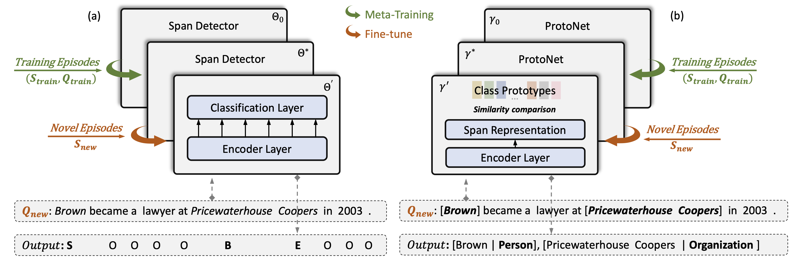

# Decomposed Meta-Learning for Few-Shot Named Entity Recognition

This repository contains the open-sourced official implementation of the paper:

[Decomposed Meta-Learning for Few-Shot Named Entity Recognition](https://arxiv.org/abs/2204.05751) (Findings of the ACL 2022).

_Tingting Ma, Huiqiang Jiang, Qianhui Wu, Tiejun Zhao, and Chin-Yew Lin_

If you find this repo helpful, please cite the following paper:

```bibtex
@inproceedings{ma-etal-2022-decomposed,
    title = "Decomposed Meta-Learning for Few-Shot Named Entity Recognition",
    author = "Ma, Tingting and Jiang, Huiqiang and Wu, Qianhui and Zhao, Tiejun and Lin, Chin-Yew",
    booktitle = "Findings of the Association for Computational Linguistics: ACL 2022",
    month = may,
    year = "2022",
    address = "Dublin, Ireland",
    publisher = "Association for Computational Linguistics",
    url = "https://aclanthology.org/2022.findings-acl.124",
    pages = "1584--1596",
}
```

For any questions/comments, please feel free to open GitHub issues.

## 🎥 Overview

Few-shot named entity recognition (NER) systems aim at recognizing novel-class named entities based on only a few labeled examples. In this paper, we present a decomposed metalearning approach which addresses the problem of few-shot NER by sequentially tackling fewshot span detection and few-shot entity typing using meta-learning. In particular, we take the few-shot span detection as a sequence labeling problem and train the span detector by introducing the model-agnostic meta-learning (MAML) algorithm to find a good model parameter initialization that could fast adapt to new entity classes. For few-shot entity typing, we propose MAML-ProtoNet, i.e., MAML-enhanced prototypical networks to find a good embedding space that can better distinguish text span representations from different entity classes. Extensive experiments on various benchmarks show that our approach achieves superior performance over prior methods.



## 🎯 Quick Start

### Requirements

- python 3.9
- pytorch 1.9.0+cu111
- [HuggingFace Transformers 4.10.0](https://github.com/huggingface/transformers)
- Few-NERD dataset

Other pip package show in `requirements.txt`.

```bash
pip3 install -r requirements.txt
```

The code may work on other python and pytorch version. However, all experiments were run in the above environment.

### Train and Evaluate

For _Linux_ machines,

```bash
bash scripts/run.sh
```

For _Windows_ machines,

```cmd
call scripts\run.bat
```

If you only want to predict in the trained model, you can get the model from [Azure blob](https://kcpapers.blob.core.windows.net/dmn-findings-acl-2022/dmn-all.zip).

Put the `models-{N}-{K}-{mode}` folder in `papers/DecomposedMetaNER` directory.

For _Linux_ machines,

```bash
bash scripts/run_pred.sh
```

For _Windows_ machines,

```cmd
call scripts\run_pred.bat
```

## 🍯 Datasets

We use the following widely-used benchmark datasets for the experiments:

- Few-NERD [Ding et al., 2021](https://aclanthology.org/2021.acl-long.248) for Intra and Inter two mode few-shot NER;
- Cross-Dataset [Hou et al., 2020](https://www.aclweb.org/anthology/2020.acl-main.128) for four cross-domain few-shot NER;

The Few-NERD dataset is annotated with 8 coarse-grained and 66 fine-grained entity types. And the Cross-Dataset are annotated with 4, 11, 6, 18 entity types in difference domain. Each dataset is split into training, dev, and test sets.

All datasets in N-way K~2K shot setting and IO tagging scheme. In this repo, we don't publish any data due to the license. You can download them from their respective websites: [Few-NERD](https://cloud.tsinghua.edu.cn/f/8483dc1a34da4a34ab58/?dl=1), and [Cross-Dataset](https://atmahou.github.io/attachments/ACL2020data.zip).
And place them in the correct locations: `./`.

## 📋 Results

We report the few-shot NER results of the proposed DecomposedMetaNER on the 1~2 shot and 5~10 shot, alongside those reported by prior state-of-the-art methods.

### Few-NERD ACL Version

You can contact [Ding et al., 2021](https://aclanthology.org/2021.acl-long.248) to get this dataset.

|                                                          | Intra 5-1        | Intra 10-1       | Intra 5-5        | Intra 10-5       | Inter 5-1        | Inter 10-1       | Inter 5-5        | Inter 10-5       |
| -------------------------------------------------------- | ---------------- | ---------------- | ---------------- | ---------------- | ---------------- | ---------------- | ---------------- | ---------------- |
| [ProtoBERT](https://aclanthology.org/2021.acl-long.248)  | 23.45 ± 0.92     | 19.76 ± 0.59     | 41.93 ± 0.55     | 34.61 ± 0.59     | 44.44 ± 0.11     | 39.09 ± 0.87     | 58.80 ± 1.42     | 53.97 ± 0.38     |
| [NNShot](https://aclanthology.org/2021.acl-long.248)     | 31.01 ± 1.21     | 21.88 ± 0.23     | 35.74 ± 2.36     | 27.67 ± 1.06     | 54.29 ± 0.40     | 46.98 ± 1.96     | 50.56 ± 3.33     | 50.00 ± 0.36     |
| [StructShot](https://aclanthology.org/2021.acl-long.248) | 35.92 ± 0.69     | 25.38 ± 0.84     | 38.83 ± 1.72     | 26.39 ± 2.59     | 57.33 ± 0.53     | 49.46 ± 0.53     | 57.16 ± 2.09     | 49.39 ± 1.77     |
| [CONTAINER](https://arxiv.org/abs/2109.07589)            | 40.43            | 33.84            | 53.70            | 47.49            | 55.95            | 48.35            | 61.83            | 57.12            |
| [ESD](https://arxiv.org/abs/2109.13023v1)                | 41.44 ± 1.16     | 32.29 ± 1.10     | 50.68 ± 0.94     | 42.92 ± 0.75     | 66.46 ± 0.49     | 59.95 ± 0.69     | **74.14** ± 0.80 | 67.91 ± 1.41     |
| **DecomposedMetaNER**                                    | **52.04** ± 0.44 | **43.50** ± 0.59 | **63.23** ± 0.45 | **56.84** ± 0.14 | **68.77** ± 0.24 | **63.26** ± 0.40 | 71.62 ± 0.16     | **68.32** ± 0.10 |

### Few-NERD Arxiv Version

Available from [Ding et al., 2021](https://github.com/thunlp/Few-NERD/blob/main/data/download.sh#L20).

|                                                | Intra 5-1        | Intra 10-1       | Intra 5-5        | Intra 10-5       | Inter 5-1        | Inter 10-1       | Inter 5-5        | Inter 10-5       |
| ---------------------------------------------- | ---------------- | ---------------- | ---------------- | ---------------- | ---------------- | ---------------- | ---------------- | ---------------- |
| [ProtoBERT](https://arxiv.org/abs/2105.07464)  | 20.76 ± 0.84     | 15.05 ± 0.44     | 42.54 ± 0.94     | 35.40 ± 0.13     | 38.83 ± 1.49     | 32.45 ± 0.79     | 58.79 ± 0.44     | 52.92 ± 0.37     |
| [NNShot](https://arxiv.org/abs/2105.07464)     | 25.78 ± 0.91     | 18.27 ± 0.41     | 36.18 ± 0.79     | 27.38 ± 0.53     | 47.24 ± 1.00     | 38.87 ± 0.21     | 55.64 ± 0.63     | 49.57 ± 2.73     |
| [StructShot](https://arxiv.org/abs/2105.07464) | 30.21 ± 0.90     | 21.03 ± 1.13     | 38.00 ± 1.29     | 26.42 ± 0.60     | 51.88 ± 0.69     | 43.34 ± 0.10     | 57.32 ± 0.63     | 49.57 ± 3.08     |
| [ESD](https://arxiv.org/abs/2109.13023)        | 36.08 ± 1.60     | 30.00 ± 0.70     | 52.14 ± 1.50     | 42.15 ± 2.60     | 59.29 ± 1.25     | 52.16 ± 0.79     | 69.06 ± 0.80     | 64.00 ± 0.43     |
| **DecomposedMetaNER**                          | **49.48** ± 0.85 | **42.84** ± 0.46 | **62.92** ± 0.57 | **57.31** ± 0.25 | **64.75** ± 0.35 | **58.65** ± 0.43 | **71.49** ± 0.47 | **68.11** ± 0.05 |

### Cross-Dataset

|                                                                        | News 1-shot      | Wiki 1-shot      | Social 1-shot   | Mixed 1-shot     | News 5-shot      | Wiki 5-shot      | Social 5-shot    | Mixed 5-shot     |
| ---------------------------------------------------------------------- | ---------------- | ---------------- | --------------- | ---------------- | ---------------- | ---------------- | ---------------- | ---------------- |
| [TransferBERT](https://www.aclweb.org/anthology/2020.acl-main.128)     | 4.75 ± 1.42      | 0.57 ± 0.32      | 2.71 ± 0.72     | 3.46 ± 0.54      | 15.36 ± 2.81     | 3.62 ± 0.57      | 11.08 ± 0.57     | 35.49 ± 7.60     |
| [SimBERT](https://www.aclweb.org/anthology/2020.acl-main.128)          | 19.22 ± 0.00     | 6.91 ± 0.00      | 5.18 ± 0.00     | 13.99 ± 0.00     | 32.01 ± 0.00     | 10.63 ± 0.00     | 8.20 ± 0.00      | 21.14 ± 0.00     |
| [Matching Network](https://www.aclweb.org/anthology/2020.acl-main.128) | 19.50 ± 0.35     | 4.73 ± 0.16      | 17.23 ± 2.75    | 15.06 ± 1.61     | 19.85 ± 0.74     | 5.58 ± 0.23      | 6.61 ± 1.75      | 8.08 ± 0.47      |
| [ProtoBERT](https://www.aclweb.org/anthology/2020.acl-main.128)        | 32.49 ± 2.01     | 3.89 ± 0.24      | 10.68 ± 1.40    | 6.67 ± 0.46      | 50.06 ± 1.57     | 9.54 ± 0.44      | 17.26 ± 2.65     | 13.59 ± 1.61     |
| [L-TapNet+CDT](https://www.aclweb.org/anthology/2020.acl-main.128)     | 44.30 ± 3.15     | 12.04 ± 0.65     | 20.80 ± 1.06    | 15.17 ± 1.25     | 45.35 ± 2.67     | 11.65 ± 2.34     | 23.30 ± 2.80     | 20.95 ± 2.81     |
| **DecomposedMetaNER**                                                  | **46.09** ± 0.44 | **17.54** ± 0.98 | **25.1** ± 0.24 | **34.13** ± 0.92 | **58.18** ± 0.87 | **31.36** ± 0.91 | **31.02** ± 1.28 | **45.55** ± 0.90 |

## Contributing

This project welcomes contributions and suggestions. Most contributions require you to agree to a
Contributor License Agreement (CLA) declaring that you have the right to, and actually do, grant us
the rights to use your contribution. For details, visit https://cla.opensource.microsoft.com.

When you submit a pull request, a CLA bot will automatically determine whether you need to provide
a CLA and decorate the PR appropriately (e.g., status check, comment). Simply follow the instructions
provided by the bot. You will only need to do this once across all repos using our CLA.

This project has adopted the [Microsoft Open Source Code of Conduct](https://opensource.microsoft.com/codeofconduct/).
For more information see the [Code of Conduct FAQ](https://opensource.microsoft.com/codeofconduct/faq/) or
contact [opencode@microsoft.com](mailto:opencode@microsoft.com) with any additional questions or comments.
