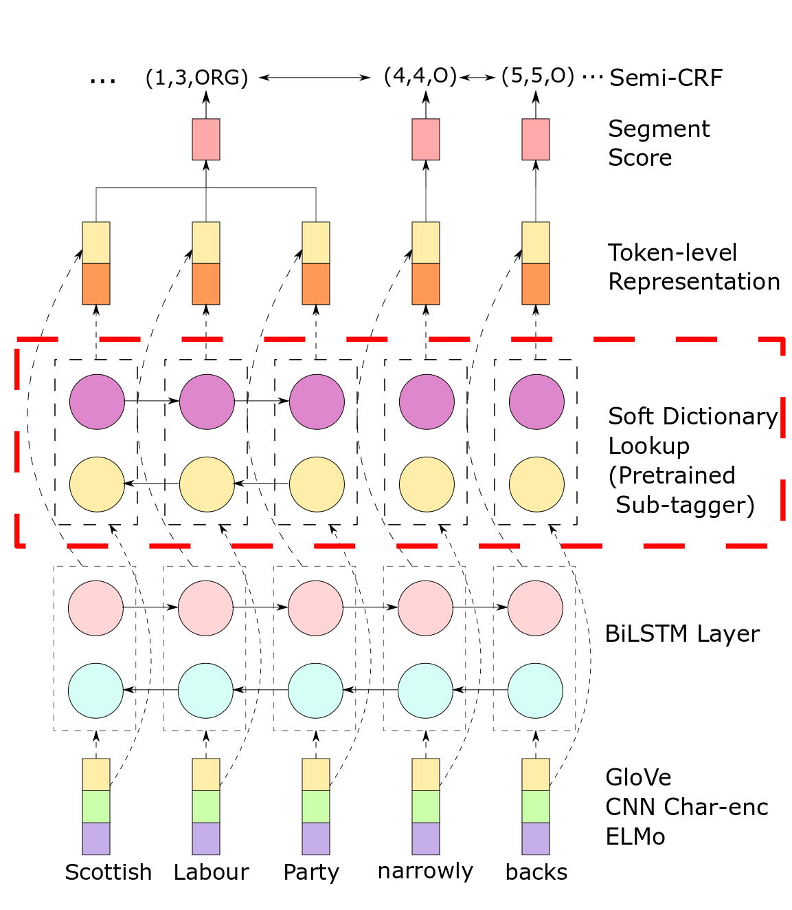

# Towards Improving Neural Named Entity Recognition with Gazetteers

This repository contains the open-sourced official implementation of our soft dictionary-enhanced NER model paper:

[Towards Improving Neural Named Entity Recognition with Gazetteers](https://aclanthology.org/P19-1524/) (ACL 2019).  
_Tianyu Liu, Jin-Ge Yao, and Chin-Yew Lin_

If you find this repo helpful, please cite either of the following versions of the paper:
```tex
@inproceedings{liu-etal-2019-towards,
    title = {Towards Improving Neural Named Entity Recognition with Gazetteers},
    author = {Tianyu Liu and Jin-Ge Yao and Chin-Yew Lin},
    booktitle = {Proceedings of the 57th Annual Meeting of the Association for Computational Linguistics},
    year = 2019,
    address = {Florence, Italy},
    publisher = {Association for Computational Linguistics},
    url = {https://aclanthology.org/P19-1524},
    doi = {10.18653/v1/P19-1524},
    pages = {5301--5307},
}
```

## Overall architecture


## Installation

First of all:
```bash
   git clone https://github.com/microsoft/vert-papers.git ; cd papers/SubTagger
```

1. Create a virtual environment with Conda
```bash
    conda create -n softdict --file requirements_conda.txt -c conda-forge/label/broken -c conda-forge
```

2. Activate the new environment
```bash
    conda activate softdict
```

3. Install the pip requirements
```bash
    pip install -r requirements_pip.txt
```

4. Prepare the configurations
```bash
    sed -i 's@INSTALLATION_DIR@'"$PWD"'@' configs/*.config
```

## Training

```bash
    allennlp train configs/HSCRF_softDictionary.conll2003.config -s dump_directory/ --include-package models 
```

## Evaluating

```bash
    allennlp evaluate dump_directory/model.tar.gz https://www.jeffliu.page/files/DATA/conll2003/test.txt --include-package models    
```

## The Gazetteer

The gazetteers, and the pretrained subtagger module can be found [here](https://drive.google.com/drive/folders/13yl8mlM1ql3jSl0gUAty8ZdiKWxN4RIM?usp=sharing)

